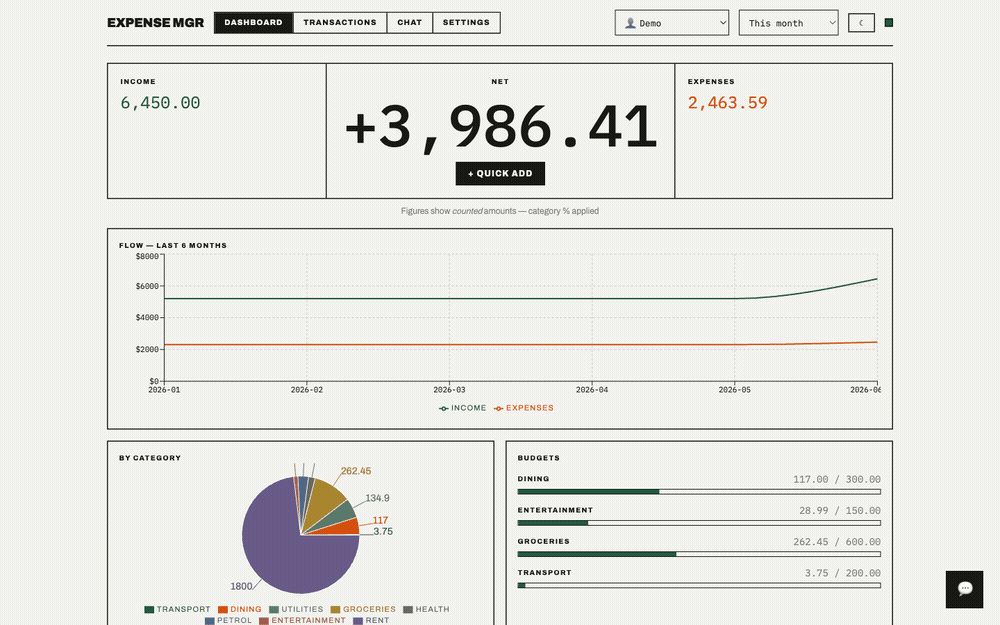
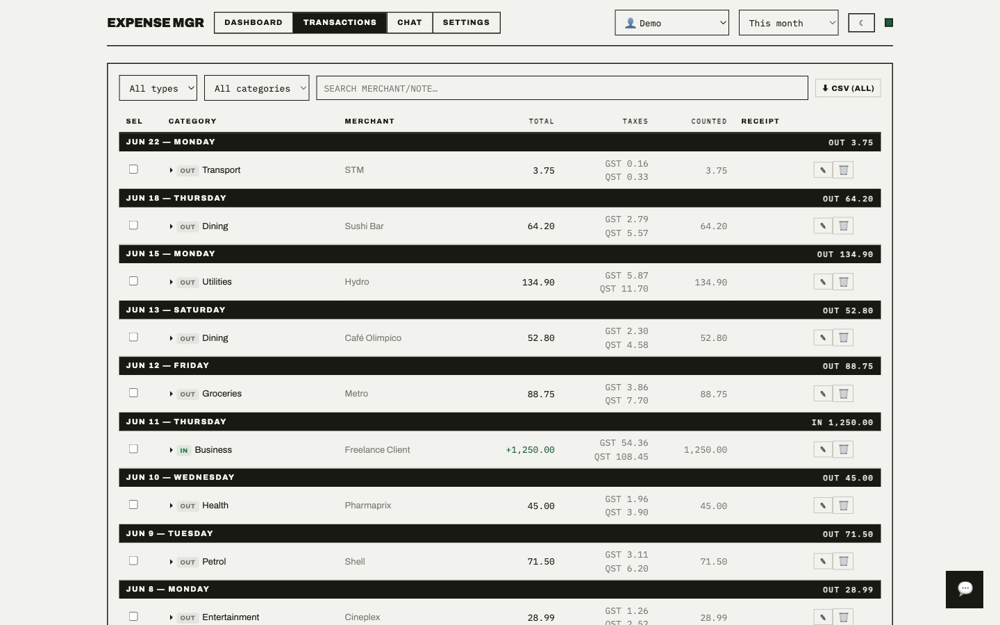
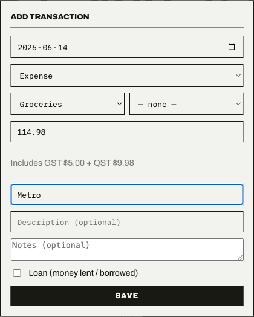
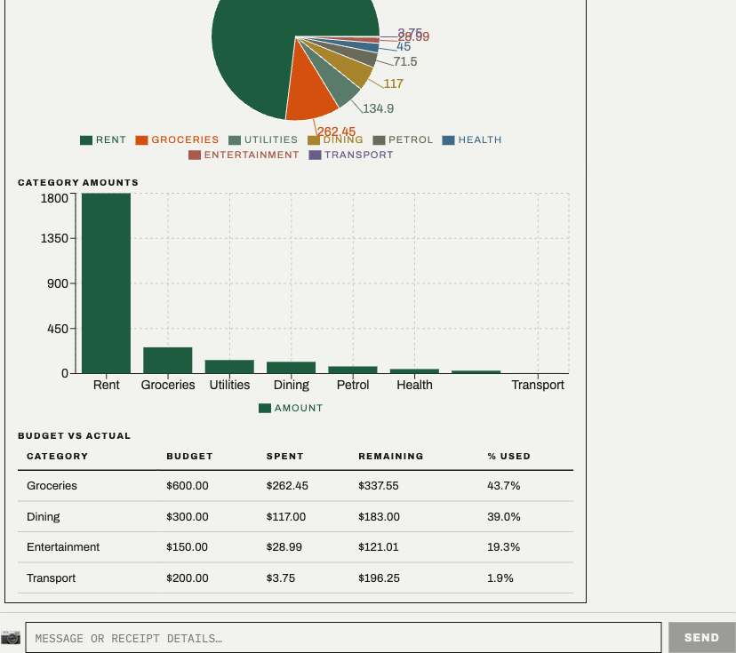
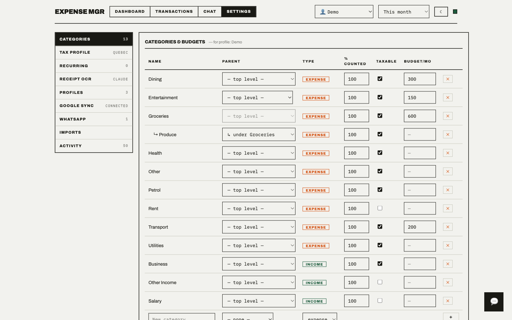

# Expense Manager

> Local-first expense tracking with an AI agent — chat it, WhatsApp it, or snap a receipt.

[](LICENSE)
[](https://www.python.org)
[](https://nodejs.org)

[Architecture](docs/architecture.md) · [Development](docs/development.md) · [Contributing](CONTRIBUTING.md) · [WhatsApp Setup](docs/whatsapp-setup.md) · [Google Sync](docs/google-drive-setup.md)

---

Income and expense tracker with a Claude agent, receipt OCR, a warm web dashboard, a WhatsApp channel, and optional one-way Google Sheets/Drive sync. SQLite on your machine is the single source of truth — everything works with just a Claude token; OCR and Google sync are opt-in add-ons.



*Enter what you paid; GST/QST are back-calculated server-side and the dashboard updates instantly.*

---

## Engineering highlights

| | |
|---|---|
| **Strict layering, zero frontend math** | Routes validate and delegate; services own all SQL and money math; the React app renders what the API computes. All tax logic lives behind one `_compute` path. |
| **Server-side tax back-calculation** | Enter the total paid; GST/QST/HST are derived from the category's taxable flag and the active tax profile — computed once, reused identically by the REST API, the chat agent, and the live quick-add preview. |
| **One agent, two channels** | A single Claude tool-calling agent backs both web chat and WhatsApp off the same service layer — no duplicated business logic per channel. |
| **Idempotent one-way Google sync** | Writes set a dirty flag; a debounced worker reconciles each profile's Sheet/Drive by mapping transaction id → row. Missing rows are removed via `deleteDimension`, not blanked. A **Re-sync Now** path (`force_full=True`) clears and rewrites the active profile's sheet in date order — restoring deleted rows and fixing ordering drift without touching other profiles. Trashed or deleted spreadsheets are auto-detected via the Drive API and recreated. |
| **Crash-safe SQLite migrations** | Idempotent migrations with atomic table rebuilds that recover orphaned scratch tables from an interrupted prior run. |
| **Profiles as full data partitions** | Each profile owns its transactions, categories, tax profile, Google Sheet, and Drive folder; every query is scoped to the active profile. |
| **Tested, not asserted** | 268+ backend tests including an adversarial sync suite designed to break reconciliation, with dependency-injected seams instead of internal patching. |

See [docs/architecture.md](docs/architecture.md) for diagrams and the reasoning behind these decisions.

---

## Features

| Feature | Description |
|---|---|
| **Profiles** | Separate books per context (Personal, Incorporation, etc.). Transactions, recurring rules, categories, tax profile, dashboard, imports, audit feed, Google sheet, and Drive folder are all strictly scoped to the active profile. |
| **Dashboard** | Income/expenses/net, 6-month trend, category pie, per-category budgets with 90% alerts, quick-add modal with live tax preview, and a duplicate-add warning. |
| **Tax back-calculation** | Enter total paid; GST/QST/HST are derived server-side from the category's taxable flag and the active tax profile (Quebec / Ontario / Alberta presets). |
| **Chat agent** | Natural-language entry, receipt photo/PDF, or CSV/XLSX/PDF statement — streaming replies with inline generative charts and tables. Confirms profile, category/sub-category, and type before recording. Drop a statement and it reviews rows, proposes categories, and records with two confirmation gates. |
| **WhatsApp** | Pair via QR, then talk to the agent in "Message yourself". Sender allowlist, weekly summary, strangers silently ignored. |
| **Sub-categories** | One level of nesting under any category (e.g. Groceries → Produce); unique per (name, profile, parent); exposed in REST, the agent, and Settings. |
| **Receipt OCR** | Images and PDF files (PyMuPDF renders each page to PNG). Selectable provider: NVIDIA PaddleOCR, Claude vision, or OpenAI vision. Works from web chat and WhatsApp. |
| **Transactions** | Filters, inline edit (taxes recomputed on save), bulk delete/recategorize, CSV export, receipt lightbox, loan flag, per-row notes. Expand any row to see the full tax breakdown. |
| **Statement imports** | Upload CSV/XLSX/PDF two ways: the review grid (inline edit category, type, total, loan, notes, receipt link per row) or in-chat (agent reviews, organizes categories, records conversationally). Duplicates flagged and pre-skipped; recording is per-row fault-tolerant. |
| **Duplicate warning** | Same total + merchant + date, or same receipt link, is flagged before saving in QuickAdd and the agent alike. Soft warning — confirm "add anyway" and it records. |
| **Recurring rules** | Rent/salary templates auto-record on schedule. Create, edit, and pause/resume in Settings or via the agent. |
| **Tax profiles** | Create/edit tax profiles and their rate components in Settings, or activate a preset (Quebec / Ontario / Alberta). |
| **Audit trail** | Every write and sync outcome logged with channel and profile. Settings → Activity. |
| **Google sync** | One-way mirror (app → Sheet + Drive), debounced, idempotent, never read back. Per-profile sheet + folder. Choose columns and order with a live preview; frozen TOTALS row; receipts shown as name + Drive link. **Re-sync Now** button rewrites the active profile's sheet from scratch in date order — use to restore deleted rows or fix ordering. Trashed/deleted sheets are auto-detected and recreated. |

---

## Screenshots

[](docs/images/dashboard.png)

| Transactions | Quick add (live tax preview) |
|---|---|
| [](docs/images/transactions.png) | [](docs/images/quick-add.png) |

| Chat agent — generative UI | Settings (categories, budgets, sub-categories) |
|---|---|
| [](docs/images/chat-generative-ui.png) | [](docs/images/settings.png) |

> Charts and tables in the chat panel are generated on the fly by the agent (`render_ui`), not hard-coded.

---

## Quickstart

**Requires Docker + Docker Compose.** For a non-Docker dev setup see [docs/development.md](docs/development.md).

```bash
cp .env.example .env   # fill in at minimum a Claude credential (see below)
make start             # Docker: web → http://localhost:5173  api → :8000
```

Then open http://localhost:5173 and try the chat: *"spent $42 at Metro on groceries"*.

```bash
make stop              # stop containers, keep state (DB, WhatsApp session)
make logs              # follow all logs  (also: logs-api, logs-web)
make cleanup           # remove containers + images; data in ./data is PRESERVED
make cleanup-data      # DESTRUCTIVE: also deletes ./data — wipes DB and WhatsApp pairing
```

Local dev without Docker: `make dev-api` / `make dev-web` — see [docs/development.md](docs/development.md).

---

## Setup & configuration

### LLM (Claude)

The agent requires one of:

| Var | How to get it |
|---|---|
| `CLAUDE_CODE_OAUTH_TOKEN` | Run `claude setup-token` (requires a Claude Max subscription) — token starts with `sk-ant-oat01-` |
| `ANTHROPIC_API_KEY` | [console.anthropic.com](https://console.anthropic.com) — pay-per-use; use this without a Claude Max subscription |

Set just one. Everything else (OCR provider, Google sync, WhatsApp) is optional and configurable in-app.

`CLAUDE_MODEL` is optional (default: `claude-sonnet-4-6`).

### WhatsApp

1. Settings → WhatsApp → **Link account** → QR code appears.
2. Phone: WhatsApp → Settings → Linked devices → Link a device → scan within ~20 s. Use **Refresh** if the code expires.
3. Open **"Message yourself"** and text the agent (`spent 23.50 at Metro groceries`, a receipt photo, `what are my expenses this month?`, …).
4. To allow other senders, add their numbers under *Allowed senders*; everyone else is silently ignored.

### Google Drive/Sheets sync (optional)

The quickest path — no redirect URI registration needed:

1. [console.cloud.google.com](https://console.cloud.google.com) → create a project
2. **APIs & Services → Library** → enable **Google Drive API** and **Google Sheets API**
3. **OAuth consent screen** → External → fill app name + email → **Test users** → add your Gmail → Save
4. **Credentials → Create credentials → OAuth 2.0 Client ID** → Application type: **Desktop app** → Download JSON
5. **Settings → Google sync → JSON key** → paste the downloaded file → Connect

The app requests only the `drive.file` scope — it sees only files it creates. Each profile gets its own Sheet and Drive subfolder, nested under one root folder: `Expense Manager / {profile} / sheet + {year} / receipts`.

For setup details and troubleshooting: [docs/google-drive-setup.md](docs/google-drive-setup.md).

### Receipt OCR (optional)

| Provider | Required var | Where to get it |
|---|---|---|
| NVIDIA PaddleOCR | `NVIDIA_API_KEY` | [build.nvidia.com](https://build.nvidia.com) |
| Claude vision | — | reuses the Claude token above |
| OpenAI vision | `OPENAI_API_KEY` | [platform.openai.com](https://platform.openai.com) |

### Environment variables

| Var | Purpose | Required |
|---|---|---|
| `CLAUDE_CODE_OAUTH_TOKEN` | Agent + Claude OCR | one of these two |
| `ANTHROPIC_API_KEY` | Agent + Claude OCR (fallback) | one of these two |
| `CLAUDE_MODEL` | Override model | no |
| `NVIDIA_API_KEY` | NVIDIA PaddleOCR | no |
| `OPENAI_API_KEY` | OpenAI vision OCR | no |
| `GOOGLE_CLIENT_ID` | Google sync | no (can paste in-app) |
| `GOOGLE_CLIENT_SECRET` | Google sync | no (can paste in-app) |
| `GOOGLE_REDIRECT_URI` | Google OAuth callback | no (default: `http://localhost:8000/api/google/callback`) |

---

## Security & privacy

- **Your data stays local.** Transactions, receipts, and chat history live in SQLite + files in `./data/`. No telemetry, no accounts, no cloud backend.
- **What leaves the machine:** chat messages and receipt images are sent to the LLM/OCR provider you configure. Google sync, if enabled, pushes transactions and receipts to *your* Sheet and Drive — one-way, never read back.
- **WhatsApp is locked down by default.** Only your own "Message yourself" chat is processed; every other sender is silently ignored unless explicitly allowlisted. Group chats are never processed.
- **Credentials** (Claude token, Google OAuth client + tokens) are stored locally — in `.env` and the SQLite settings table.

---

## Data & state

All persistent data lives in **`./data/`** at the repo root (`expense.db`, `receipts/`, `whatsapp/`), bind-mounted into the container. This survives `docker compose down -v`, volume prune, and `make cleanup`. Local dev (`make dev-api`) uses the same `./data/` directory.

`make cleanup` removes only containers and images — data is untouched.  
`make cleanup-data` is the destructive command that deletes `./data/` including the database and WhatsApp pairing.

---

## Documentation

| I want to… | Read |
|---|---|
| Set up Google Drive/Sheets sync (step by step) | [docs/google-drive-setup.md](docs/google-drive-setup.md) |
| Set up WhatsApp pairing | [docs/whatsapp-setup.md](docs/whatsapp-setup.md) |
| Understand system design (diagrams, data flow, decisions) | [docs/architecture.md](docs/architecture.md) |
| Set up a dev environment, run tests, add a feature | [docs/development.md](docs/development.md) |
| Contribute a PR | [CONTRIBUTING.md](CONTRIBUTING.md) |

---

## Contributing

Bug reports, fixes, and new integrations are welcome. See [CONTRIBUTING.md](CONTRIBUTING.md) for priorities, workflow rules, protected code, and PR expectations.
