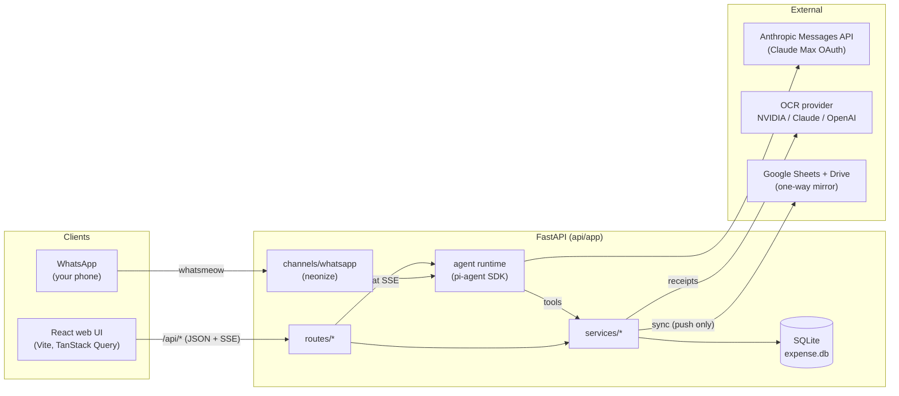
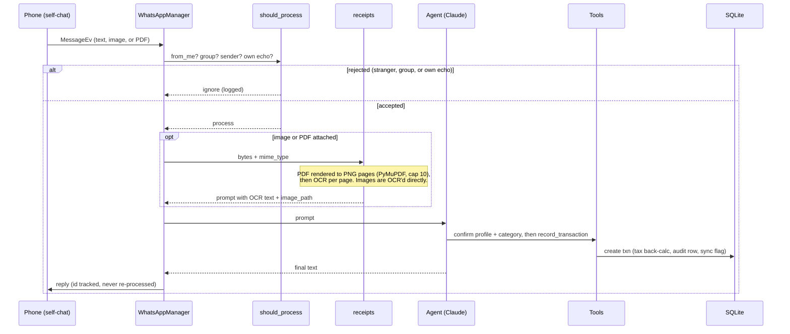
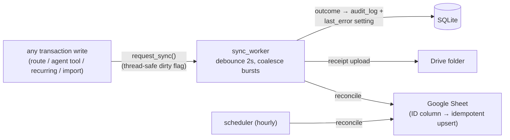
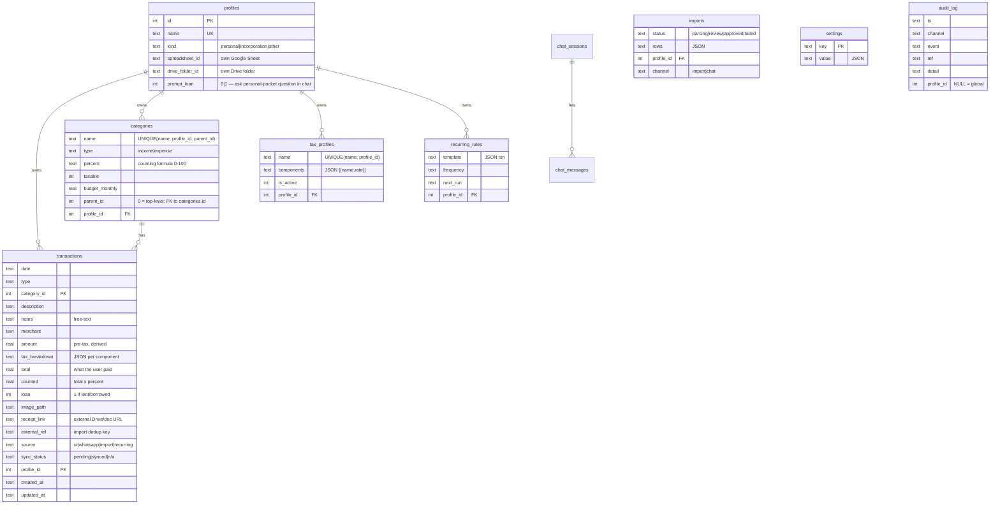
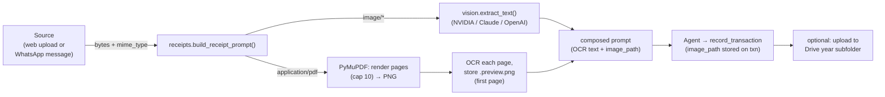

# Architecture

**Design decisions, system structure, and data flows.** For features and quickstart see the [README](../README.md); for dev setup and test conventions see [Development](development.md); for PR guidelines see [Contributing](../CONTRIBUTING.md).

*Read this when:* understanding how layers interact · adding a new channel, agent tool, or sync column · debugging unexpected data or sync behavior

---

Local-first: **SQLite is the only source of truth**. Google is a one-way, optional mirror. The frontend contains zero business logic — every dollar figure is computed server-side.

## System context



## Backend layering

```
routes/      thin HTTP: validate (pydantic), open conn, call service
services/    ALL business logic + SQL + money math
channels/    transport adapters (WhatsApp today) behind BaseChannelRegistry
agent/       pi-agent runtime, Claude provider, tool definitions
db.py        connection, schema, seeds, migrations, settings KV
```

### Boundaries

- Routes do not execute SQL directly — all SQL lives in `services/`.
- Services do not import from `routes/` or `agent/`.
- `agent/tools.py` wraps services; it does not duplicate their logic.
- `channels/` normalises the transport; it does not own business rules.
- Every service function takes `conn: sqlite3.Connection` as its first arg —
  no hidden globals. Routes wrap calls in `with get_db() as conn:`.
- Money math lives in **one** place: `services/transactions._compute` →
  `services/tax.back_calculate`. Create, update, and bulk recategorize all
  reuse it. `round(x, 2)` at service boundaries.
- The duplicate rule lives **only** in `dedup.find_duplicate` — change it there, nowhere else.
- API errors are `AppError(code, message, status, details=None)` → rendered by
  `errors.register_error_handler` as `{"error": {code, message}}`, plus a
  `details` object when set (e.g. `duplicate_suspected` ships the matched txn).
- Settings-table keys are constants in `settings_keys.py` — never inline
  strings.

## Message pipeline (WhatsApp → agent → reply)



The gate (`channels/whatsapp.should_process`, pure + unit-tested):

| Message | Decision |
|---|---|
| group / broadcast | ignore |
| our own outbound reply (tracked message id) | ignore — no loops |
| from-me where chat == sender (self-chat, incl. hidden `@lid` JIDs) | **process** |
| from someone on the allowlist | **process** |
| anyone else | ignore (silent) |

## Channels

`channels/base.BaseChannelRegistry` is the contract `main.py` codes against
(`set_handler / start / list_accounts / send_weekly_summary`).
`WhatsAppRegistry` owns N `WhatsAppManager`s — one neonize client + session DB
per paired account (`data_dir/whatsapp/{id}.sqlite3`). Adding Telegram =
implement the protocol, append to `main.CHANNELS`.

`WhatsAppManager(client_factory=...)` is injectable so tests drive the real
`start()` wiring with a fake client.

## Agent runtime

- `agent/runtime.Session`: one pi-agent `Agent` per chat session; history
  replayed from `chat_store` on construction (survives restarts); streams
  normalized events (`delta / tool / ui / done`) to the SSE route.
- `agent/anthropic_provider.py`: Anthropic Messages API with Claude Max OAuth
  (`Bearer` + `anthropic-beta: oauth-2025-04-20` + mandatory Claude Code
  system block) or `x-api-key` fallback. **Protected — verified live.**
- `agent/tools.py`: thin async wrappers over the same services the HTTP routes
  use — no duplicated business logic. Each tool wraps its body in `try/except`
  and returns `{"error": ...}` for friendly degradation.

The tool set:

| Tool | Notes |
|---|---|
| `record_transaction` | total only (taxes derived server-side); also `notes`, `receipt_link`; on a likely duplicate returns `{duplicate: true, …}` instead of saving — re-call with `confirm_duplicate: true` to override |
| `update_transaction` / `delete_transaction` | edit or remove by id |
| `query_transactions` | date / type / category / text / loan filters |
| `get_summary` | dashboard-style aggregates |
| `manage_categories` / `manage_budgets` | set categories / per-category budgets |
| `manage_recurring` | list / create / update (edit + pause/resume via `active`) / delete |
| `list_profiles` / `set_active_profile` | available on every channel, incl. WhatsApp |
| `get_import_summary` | summarise a parsed statement import by id — counts, duplicates, category buckets, unresolved rows, a sample (read-only) |
| `remap_import` | assign categories to statement rows by id (`{match: merchant/contains/index → category_id}`); re-checks duplicates |
| `approve_import` | record a reviewed statement import (optionally only some row indexes); per-row fault-tolerant, idempotent via `external_ref` |
| `render_ui` | **web only** — emits declarative chart/table/metric specs the frontend renders verbatim (GenUI) |

**Per-call profile targeting.** Every data tool above (`record/update/delete/
query_transactions`, `get_summary`, `manage_categories/budgets/recurring`) accepts
an optional `profile` name and operates on that book for that one call — so the
agent can answer about, or write to, a non-active profile **without** calling
`set_active_profile` (which would shift the active book the web UI and other
channels share). It only switches the active profile when the user explicitly asks.

**Confirm flow (web and WhatsApp).** Before calling `record_transaction` the
agent confirms, in one message, the target profile (required when 2+ profiles
exist), the category/sub-category, the income/expense type, and — when the
chosen profile's `prompt_loan` is `true` — whether the expense was paid from
personal pocket ("I'll mark it as reimbursable"); `loan=true` is set if the
user says yes. The tool runs only after the user confirms or corrects. If the original message already states
profile and category unambiguously, the agent may proceed without a round-trip,
but still reports what it recorded. If the tool comes back flagged as a possible
duplicate, the agent relays the matched transaction and asks before re-recording
(see Duplicate detection).

**Chat statement import (web only).** When a CSV/XLSX/PDF is uploaded in web chat,
`imports.classify_and_start` decides receipt vs statement (spreadsheets are always
statements; a PDF is parsed and treated as a statement only if it yields ≥2 rows,
else a receipt). A statement is parsed into a pending import (status `review`) and
the agent is handed its `import_id`. The agent then: `get_import_summary` →
proposes category/sub-category changes (and applies them with `manage_categories`
only after the user agrees — **gate 1**) → `remap_import` to assign the unresolved
rows → shows the final mapping and waits for the user (**gate 2**) → `approve_import`.
The parsed rows live in the `imports` table the whole time — the agent works by
`import_id` over summaries and a mapping, never the full row payload, so context
stays bounded on large statements. The flow reuses the existing import pipeline
(`parse_with_agent`, `dedup.flag_duplicates`, `approve_import`), so dedup, audit
(`channel='chat'`), idempotency and per-row fault tolerance all apply unchanged.
WhatsApp is out of scope (its document handling only carries pdf/image; see
`docs/design/2026-06-15-chat-statement-import.md`).

## Duplicate detection

One rule, defined once in `services/dedup.find_duplicate(conn, data, profile_id)`,
flags a transaction as a likely duplicate of an existing one in the same profile
when **either** trigger fires:

- **receipt** — a non-empty `receipt_link` exactly matches an existing row (a
  re-shared receipt is almost certainly the same expense);
- **fields** — same `total` + `merchant` (case-insensitive) + `date` (exact day).

Merchant in the key avoids false positives on legitimate repeats (two $5 coffees at
different shops); exact-day avoids fuzzy noise. The function is a pure read.

It is a **soft warning, never a hard block** — duplicates are sometimes real, so the
user always decides. The gate lives in the shared chokepoint
`transactions.create_transaction(conn, data, *, check_duplicate=False)`: when a
caller opts in and `data["confirm_duplicate"]` is falsy, a hit raises
`AppError("duplicate_suspected", …, 409, details={reason, txn})` and nothing is
written. Each surface handles it:

| Surface | Opts in | On a hit | Override |
|---|---|---|---|
| Web QuickAdd (`POST /api/transactions`) | yes | 409 + match → "Possible duplicate… Add anyway?" | re-POST with `confirm_duplicate: true` |
| Agent `record_transaction` | yes | tool returns `{duplicate: true, match, reason}` → agent warns | re-call with `confirm_duplicate: true` |
| Statement import grid | n/a | row flagged via `dedup.flag_duplicates` (same rule), pre-skipped | per-row skip toggle |
| Recurring rules | **no** | never flagged (monthly rent is not a duplicate) | — |

`flag_duplicates` (import grid) is a thin wrapper over `find_duplicate`, so the
review grid and the live add paths share exactly one definition.

## Sync (one-way, event-driven)



**Trigger and worker.** Every write calls `sync.request_sync()`, which sets a
thread-safe dirty flag. One long-lived `sync_worker` debounces bursts (~2s) and
runs a single `reconcile()` per burst; an hourly scheduler tick also reconciles
as a catch-up.

**Idempotent reconcile.** The sheet's ID column maps app txn id → row. Pending
or missing rows are upserted; rows whose txn id no longer exists are *removed*
with `deleteDimension` (not blanked). Sync never reads data back.

**Configurable per-profile columns.** A column registry (`COLUMN_REGISTRY`)
drives the sheet, and each profile stores its own ordered selection
(`SHEET_COLUMN_CONFIG`, edited via `GET/PUT /api/google/columns` and the Settings
checklist). Header, data row, and number formatting all derive from that one
resolved list, so there is no positional drift. `id` is always present and first
(keeps the id→row map valid). Changing the set or order rewrites the whole tab.

- *Available columns:* ID, Date, Type, Category, Sub-category, Description,
  Merchant, Amount, per-component tax columns, Total, Counted % (the category
  percent, e.g. `20%`), Counted, Receipt (a readable derived name), Receipt Link
  (the Drive URL), Source, Loan, Notes, plus opt-in Created/Updated.
- *Per-component tax columns:* the `tax` column expands into one column per
  component (e.g. `GST`, `QST`), derived per profile from its active tax profile
  plus any component seen in its transactions.

**Frozen TOTALS row.** Row 1 is the header; row 2 is a frozen, coloured `TOTALS`
row (both rows frozen, so totals stay visible while scrolling); data starts at
row 3. Each money column holds an open-ended `=SUM(col3:col)`, so totals
auto-extend as rows are appended — no recompute on add or delete.

**Per-profile isolation.** Each profile mirrors to its own spreadsheet (`Expense
Manager — {name}`) and Drive subfolder, with the ids stored on the `profiles`
row. `reconcile()` loops every profile, lazily creating its sheet and folder on
first sync. Creation is idempotent: an existing same-named sheet in the folder is
reused before a new one is created, preventing duplicates on reconnect.

**Layout details.**

- *Year tabs:* new spreadsheets get one tab per calendar year (current year
  leftmost) plus a cross-year **Summary** tab that sums each year (open-ended
  from row 3, so per-tab `TOTALS` rows are never double-counted). Legacy
  single-`Transactions`-tab sheets keep that layout but still get the frozen row.
- *Drive folders:* receipts are stored as
  `{base_name} — {profile_name}/{year}/{date}_{id}_{merchant}.{ext}`; year-folder
  ids are cached in settings to avoid a Drive list call per upload.

**Failures** land in `audit_log` and the `last_error` setting (shown in
Settings) — never silent.

## Data model



Sub-categories are one level deep: `categories.parent_id = 0` means top-level;
a non-zero `parent_id` points to the parent category row. The uniqueness
constraint is `(name, profile_id, parent_id)` — so the same name can exist once
as a top-level category and once as a sub-category. Because of that, writes
resolve categories by **id** where possible (the UI sends `category_id`; the
sheet/CSV stay correct); `find_category_by_name` **raises** on an ambiguous name
rather than silently picking one (which previously produced wrong taxes/counted).
The dashboard rolls sub-category spend up to the top-level parent for the pie and
budgets (a child with its own budget is tracked on its own line, not double-counted).

Migrations are idempotent blocks in `db.init_db()` (added via `PRAGMA
table_info` checks): `receipt_link`, `loan`, `parent_id` on categories,
`profile_id` on `imports` (scopes statement imports per profile), `channel` on
`imports` (`'import'` default; `'chat'` marks chat-originated imports) and on
`audit_log` (nullable — NULL = global event such as a sync run),
`prompt_loan` on `profiles` (default 0); legacy settings keys migrated then
deleted. The profiles migration rebuilds
`categories` and `tax_profiles` with `UNIQUE(name, profile_id[, parent_id])`
on a dedicated AUTOCOMMIT connection (see `_migrate_profiles`).

**Data directory**: persistent data (`expense.db`, `receipts/`, `whatsapp/`)
lives in a host bind mount at the repo-root `./data` directory (mapped to
`/app/data` inside the container). `make cleanup` stops containers but
**preserves `./data`**; `make cleanup-data` also removes it.

## Receipt pipeline



- Original file (image or PDF) is stored at `data/receipts/<filename>`.
- For PDFs a `<filename>.preview.png` (first-page render) is also stored.
- Served via `GET /api/receipts/{id}` (original) and
  `GET /api/receipts/{id}/preview` (PNG thumbnail). If no preview exists for
  an image receipt, the preview endpoint returns the original.
- The WhatsApp channel accepts both **image messages** and **PDF document
  messages** — both feed the same pipeline.

## Profile scoping

Every query (transactions, recurring, categories, tax profiles, dashboard,
imports, audit events) is scoped to the active profile via
`profiles.active_id(conn)`. All service functions take `conn` as their first
argument — no global state.

`run_due_rules` is the one exception: it fires recurring rules across **all**
profiles (each rule carries its own `profile_id`) so scheduled transactions
are never missed while the user has a different profile active. Each rule runs in
its own `try/except` — one broken rule (e.g. an unresolvable template category)
is deactivated + audited rather than starving the others, and catch-up is capped
per tick so a `next_run` set far in the past can't back-fill an unbounded burst.

## Schedulers (lifespan tasks)

| Task | Cadence | Job |
|---|---|---|
| `_scheduler_loop` | hourly tick | run due recurring rules; reconcile if connected; Sunday ≥18:00 weekly WhatsApp summary |
| `sync_worker` | event-driven | debounced reconcile on write |

## Key invariants

1. Frontend never computes money — the QuickAdd tax preview is display-only;
   the server result wins.
2. The agent never computes taxes — tools take `total`, services derive.
3. Google is write-only. Deleting the sheet loses nothing.
4. Every transaction write produces an `audit_log` row with its origin
   channel.
5. **Protected code** — do not change behavior of the files listed in the
   [protected-code table in docs/development.md](development.md#protected-code--do-not-change-behavior).

---

## Related

- [README](../README.md) — features, quickstart, and setup
- [docs/development.md](development.md) — dev setup, test conventions, and API surface
- [CONTRIBUTING.md](../CONTRIBUTING.md) — priorities, workflow rules, and PR expectations
