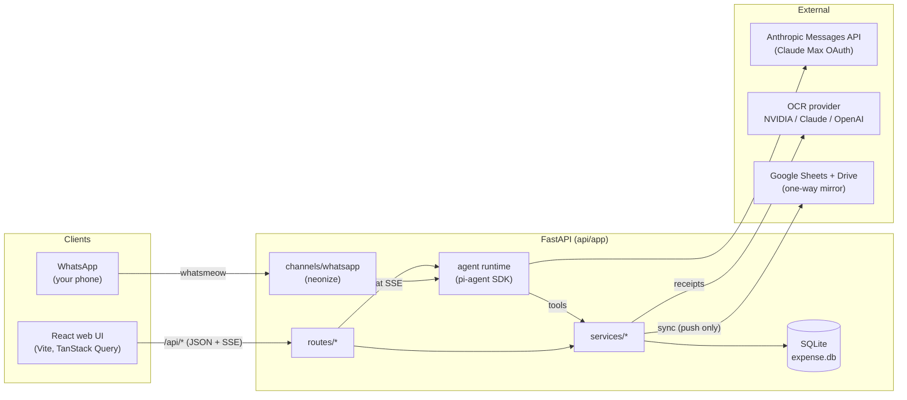
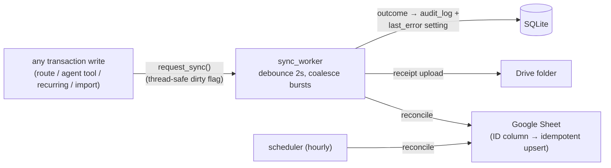
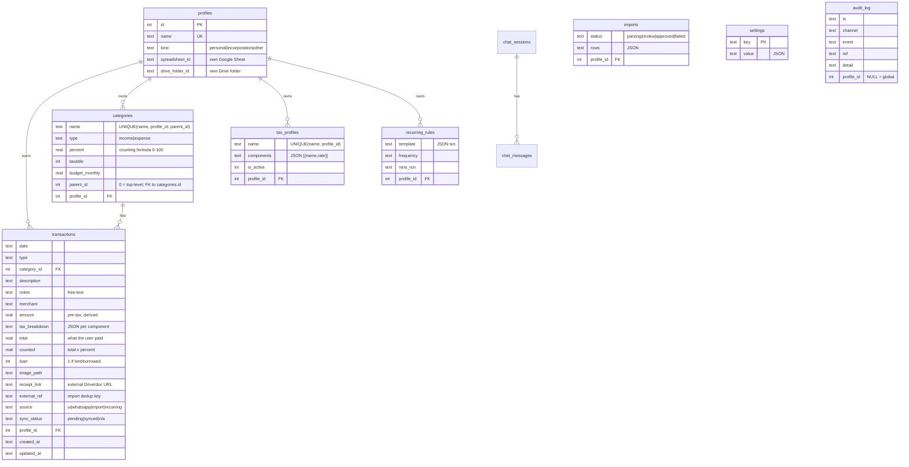

# Architecture

This document explains the **how and why** of design decisions and system structure — not features or setup. For running the app see the [README](../README.md); for contributing and test conventions see [docs/development.md](development.md).

Local-first: **SQLite is the only source of truth**. Google is a one-way, optional mirror. The frontend contains zero business logic — every dollar figure is computed server-side.

## System context



## Backend layering

```
routes/      thin HTTP: validate (pydantic), open conn, call service
services/    ALL business logic + SQL + money math
channels/    transport adapters (WhatsApp today) behind BaseChannelRegistry
agent/       pi-agent runtime, Claude provider, tool definitions
db.py        connection, schema, seeds, migrations, settings KV
```

Rules that keep it clean:

- Every service function takes `conn: sqlite3.Connection` as its first arg —
  no hidden globals. Routes wrap calls in `with get_db() as conn:`.
- Money math lives in **one** place: `services/transactions._compute` →
  `services/tax.back_calculate`. Create, update, and bulk recategorize all
  reuse it. `round(x, 2)` at service boundaries.
- API errors are `AppError(code, message, status)` → rendered by
  `errors.register_error_handler` as `{"error": {code, message}}`.
- Settings-table keys are constants in `settings_keys.py` — never inline
  strings.

## Message pipeline (WhatsApp → agent → reply)

```mermaid
sequenceDiagram
    participant P as Phone (self-chat)
    participant W as WhatsAppManager
    participant G as should_process gate
    participant R as receipts.build_receipt_prompt
    participant A as Agent (pi-agent + Claude)
    participant T as Tools
    participant DB as SQLite

    P->>W: MessageEv (text, image, or PDF document)
    W->>G: from_me? group? sender? own reply id?
    alt rejected (stranger / group / own echo)
        G-->>W: ignore (logged)
    else accepted
        G-->>W: PROCESS
        alt image or PDF document attached
            W->>R: image_bytes + mime_type
            R->>R: PDF → render pages (PyMuPDF, cap 10)<br/>→ OCR each page; store .preview.png<br/>Image → OCR directly
            R-->>W: composed prompt with OCR text + image_path
        end
        W->>A: prompt
        A->>T: confirm profile + category, then record_transaction(total=...)
        T->>DB: create txn (tax back-calc, audit row, sync dirty flag)
        A-->>W: final text
        W->>P: reply (id tracked → never re-processed)
    end
```

The gate (`channels/whatsapp.should_process`, pure + unit-tested):

| Message | Decision |
|---|---|
| group / broadcast | ignore |
| our own outbound reply (tracked message id) | ignore — no loops |
| from-me where chat == sender (self-chat, incl. hidden `@lid` JIDs) | **process** |
| from someone on the allowlist | **process** |
| anyone else | ignore (silent) |

## Channels

`channels/base.BaseChannelRegistry` is the contract `main.py` codes against
(`set_handler / start / list_accounts / send_weekly_summary`).
`WhatsAppRegistry` owns N `WhatsAppManager`s — one neonize client + session DB
per paired account (`data_dir/whatsapp/{id}.sqlite3`). Adding Telegram =
implement the protocol, append to `main.CHANNELS`.

`WhatsAppManager(client_factory=...)` is injectable so tests drive the real
`start()` wiring with a fake client.

## Agent runtime

- `agent/runtime.Session`: one pi-agent `Agent` per chat session; history
  replayed from `chat_store` on construction (survives restarts); streams
  normalized events (`delta / tool / ui / done`) to the SSE route.
- `agent/anthropic_provider.py`: Anthropic Messages API with Claude Max OAuth
  (`Bearer` + `anthropic-beta: oauth-2025-04-20` + mandatory Claude Code
  system block) or `x-api-key` fallback. **Protected — verified live.**
- `agent/tools.py`: thin async wrappers over services —
  `record_transaction` (total only; taxes server-side; also takes `notes`,
  `receipt_link`, and an optional `profile`), `update_transaction` /
  `delete_transaction` (edit/remove by id), `query_transactions` (incl. text +
  loan filters), `get_summary`, `manage_categories` / `manage_budgets` (both take
  an optional `profile` so they act on the right book, not silently the active
  one), `manage_recurring` (list/create/**update** (edit + pause/resume via
  `active`)/delete), `list_profiles`, `set_active_profile` (now on **every**
  channel incl. WhatsApp), and `render_ui` (**web only**) which emits declarative
  chart/table/metric specs the frontend renders verbatim (GenUI).
- **Confirm flow (both web and WhatsApp)**: before calling `record_transaction`
  the agent always confirms (in one message) the target profile (required when
  2+ profiles exist), the category/sub-category, and the income/expense type.
  Only after the user confirms (or corrects) does the tool call execute.
  If the user's message already states profile and category unambiguously, the
  agent may proceed without a round-trip but still reports what it recorded.

## Sync (one-way, event-driven)



- Services fire `sync.request_sync()` on every write; a single long-lived
  `sync_worker` debounces and runs one `reconcile()` per burst.
- `reconcile()` is idempotent: the sheet's ID column maps app txn id → row;
  pending/missing rows are upserted, and rows whose txn id no longer exists are
  **removed** (`deleteDimension`, not blanked). Never reads data back.
- **Configurable, per-profile columns**: a column registry (`COLUMN_REGISTRY`)
  drives the sheet. Each profile stores its own ordered/selected column list
  (`SHEET_COLUMN_CONFIG` setting, edited via `GET/PUT /api/google/columns` and the
  Settings checklist with up/down reorder). Header, data row, and
  number-formatting all derive from one resolved column list, so there is no
  positional drift; `id` is always present and first (keeps the id→row map
  valid). Available columns: ID, Date, Type, Category, Sub-category, Description,
  Merchant, Amount, the per-component tax columns, Total, **Counted %** (the
  category percent, e.g. `20%`), Counted, **Receipt** (a readable derived name) +
  **Receipt Link** (the Drive URL), Source, Loan, Notes, plus opt-in
  Created/Updated. Changing the set/order rewrites the whole tab.
- **Per-component tax columns**: the `tax` column expands into one column per tax
  component (e.g. `GST`, `QST`), computed per profile from its active tax profile
  plus any component seen in its transactions.
- **Frozen TOTALS row**: row 1 is the header, **row 2 is a frozen, coloured
  `TOTALS` row** (both rows frozen so totals stay visible while scrolling), and
  data starts at row 3. Each money column holds an open-ended `=SUM(col3:col)`, so
  the total auto-extends as rows are appended — no recompute on add/delete.
- **Per-profile**: each profile mirrors to its own spreadsheet (`Expense
  Manager — {name}`) and its own Drive subfolder (named after the profile,
  nested under the `Expense Manager` root folder), with the
  ids stored on the `profiles` row. `reconcile()` loops every profile, lazily
  creating its sheet/folder on first sync. Spreadsheet creation is idempotent:
  the app reuses an existing same-named sheet in the folder before creating a
  new one, preventing duplicates on reconnect.
- **Year-based sheet tabs**: new spreadsheets get one tab per calendar year
  (`2025`, `2026`, …); the current year is always the leftmost tab, plus a
  cross-year **Summary** tab that sums each year's data (open-ended from row 3, so
  the per-tab `TOTALS` rows are never double-counted). Legacy spreadsheets that
  already have a "Transactions" tab keep the single-tab layout but still get the
  frozen `TOTALS` row.
- **Year subfolders in Drive**: receipts are organised as
  `{base_name} — {profile_name}/{year}/{date}_{id}_{merchant}.{ext}`.
  Year folder IDs are cached in the settings table to avoid a Drive list call
  on every upload.
- Failures land in `audit_log` + `last_error` (shown in Settings) — never
  silent.

## Data model



Sub-categories are one level deep: `categories.parent_id = 0` means top-level;
a non-zero `parent_id` points to the parent category row. The uniqueness
constraint is `(name, profile_id, parent_id)` — so the same name can exist once
as a top-level category and once as a sub-category. Because of that, writes
resolve categories by **id** where possible (the UI sends `category_id`; the
sheet/CSV stay correct); `find_category_by_name` **raises** on an ambiguous name
rather than silently picking one (which previously produced wrong taxes/counted).
The dashboard rolls sub-category spend up to the top-level parent for the pie and
budgets (a child with its own budget is tracked on its own line, not double-counted).

Migrations are idempotent blocks in `db.init_db()` (added via `PRAGMA
table_info` checks): `receipt_link`, `loan`, `parent_id` on categories,
`profile_id` on `imports` (scopes statement imports per profile) and on
`audit_log` (nullable — NULL = global event such as a sync run); legacy
settings keys migrated then deleted. The profiles migration rebuilds
`categories` and `tax_profiles` with `UNIQUE(name, profile_id[, parent_id])`
on a dedicated AUTOCOMMIT connection (see `_migrate_profiles`).

**Data directory**: persistent data (`expense.db`, `receipts/`, `whatsapp/`)
lives in a host bind mount at the repo-root `./data` directory (mapped to
`/app/data` inside the container). `make cleanup` stops containers but
**preserves `./data`**; `make cleanup-data` also removes it.

## Receipt pipeline


- Original file (image or PDF) is stored at `data/receipts/<filename>`.
- For PDFs a `<filename>.preview.png` (first-page render) is also stored.
- Served via `GET /api/receipts/{id}` (original) and
  `GET /api/receipts/{id}/preview` (PNG thumbnail). If no preview exists for
  an image receipt, the preview endpoint returns the original.
- The WhatsApp channel accepts both **image messages** and **PDF document
  messages** — both feed the same pipeline.

## Profile scoping

Every query (transactions, recurring, categories, tax profiles, dashboard,
imports, audit events) is scoped to the active profile via
`profiles.active_id(conn)`. All service functions take `conn` as their first
argument — no global state.

`run_due_rules` is the one exception: it fires recurring rules across **all**
profiles (each rule carries its own `profile_id`) so scheduled transactions
are never missed while the user has a different profile active. Each rule runs in
its own `try/except` — one broken rule (e.g. an unresolvable template category)
is deactivated + audited rather than starving the others, and catch-up is capped
per tick so a `next_run` set far in the past can't back-fill an unbounded burst.

## Schedulers (lifespan tasks)

| Task | Cadence | Job |
|---|---|---|
| `_scheduler_loop` | hourly tick | run due recurring rules; reconcile if connected; Sunday ≥18:00 weekly WhatsApp summary |
| `sync_worker` | event-driven | debounced reconcile on write |

## Key invariants

1. Frontend never computes money — the QuickAdd tax preview is display-only;
   the server result wins.
2. The agent never computes taxes — tools take `total`, services derive.
3. Google is write-only. Deleting the sheet loses nothing.
4. Every transaction write produces an `audit_log` row with its origin
   channel.
5. **Protected code** — do not change behavior of the files listed in the
   [protected-code table in docs/development.md](development.md#protected-code--do-not-change-behavior).
