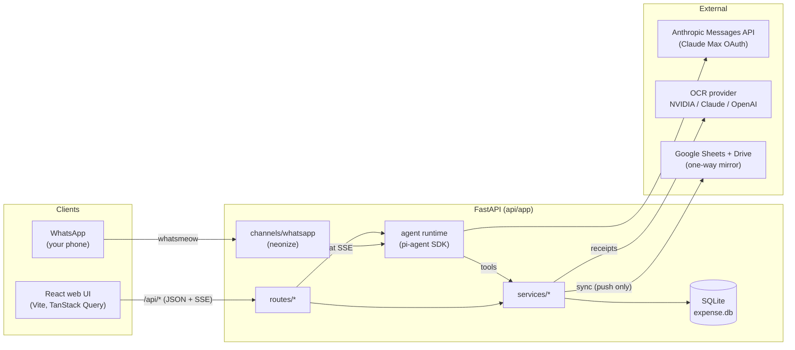
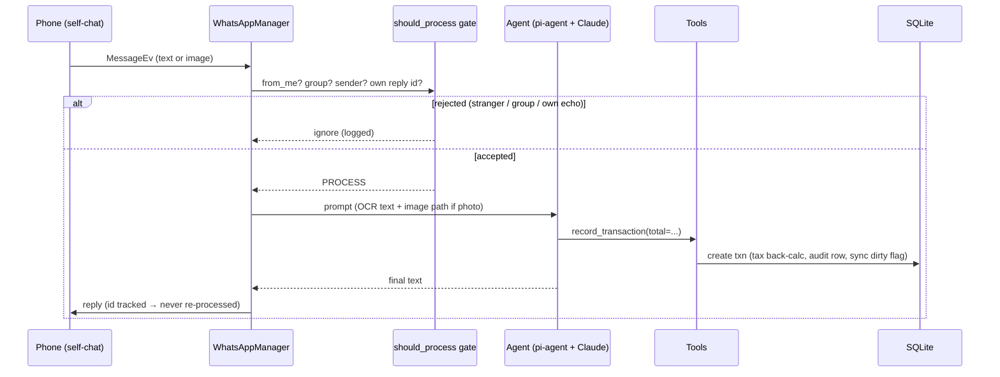
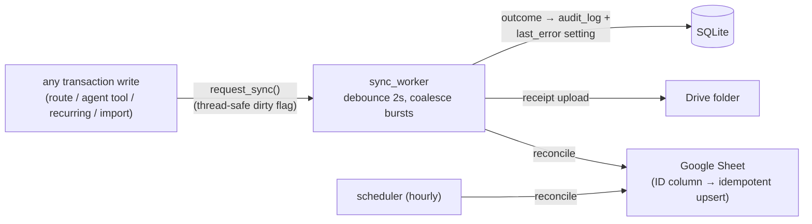
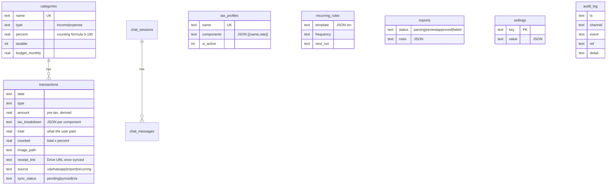

# Architecture

Local-first: **SQLite is the only source of truth**. Google is a one-way,
optional mirror. The frontend contains zero business logic — every dollar
figure is computed server-side.

## System context



## Backend layering

```
routes/      thin HTTP: validate (pydantic), open conn, call service
services/    ALL business logic + SQL + money math
channels/    transport adapters (WhatsApp today) behind BaseChannelRegistry
agent/       pi-agent runtime, Claude provider, tool definitions
db.py        connection, schema, seeds, migrations, settings KV
```

Rules that keep it clean:

- Every service function takes `conn: sqlite3.Connection` as its first arg —
  no hidden globals. Routes wrap calls in `with get_db() as conn:`.
- Money math lives in **one** place: `services/transactions._compute` →
  `services/tax.back_calculate`. Create, update, and bulk recategorize all
  reuse it. `round(x, 2)` at service boundaries.
- API errors are `AppError(code, message, status)` → rendered by
  `errors.register_error_handler` as `{"error": {code, message}}`.
- Settings-table keys are constants in `settings_keys.py` — never inline
  strings.

## Message pipeline (WhatsApp → agent → reply)



The gate (`channels/whatsapp.should_process`, pure + unit-tested):

| Message | Decision |
|---|---|
| group / broadcast | ignore |
| our own outbound reply (tracked message id) | ignore — no loops |
| from-me where chat == sender (self-chat, incl. hidden `@lid` JIDs) | **process** |
| from someone on the allowlist | **process** |
| anyone else | ignore (silent) |

## Channels

`channels/base.BaseChannelRegistry` is the contract `main.py` codes against
(`set_handler / start / list_accounts / send_weekly_summary`).
`WhatsAppRegistry` owns N `WhatsAppManager`s — one neonize client + session DB
per paired account (`data_dir/whatsapp/{id}.sqlite3`). Adding Telegram =
implement the protocol, append to `main.CHANNELS`.

`WhatsAppManager(client_factory=...)` is injectable so tests drive the real
`start()` wiring with a fake client.

## Agent runtime

- `agent/runtime.Session`: one pi-agent `Agent` per chat session; history
  replayed from `chat_store` on construction (survives restarts); streams
  normalized events (`delta / tool / ui / done`) to the SSE route.
- `agent/anthropic_provider.py`: Anthropic Messages API with Claude Max OAuth
  (`Bearer` + `anthropic-beta: oauth-2025-04-20` + mandatory Claude Code
  system block) or `x-api-key` fallback. **Protected — verified live.**
- `agent/tools.py`: thin async wrappers over services —
  `record_transaction` (total only; taxes server-side), `query_transactions`,
  `get_summary`, `manage_categories`, `manage_budgets`, `manage_recurring`,
  and `render_ui` (web only) which emits declarative chart/table/metric specs
  the frontend renders verbatim (GenUI).

## Sync (one-way, event-driven)



- Services fire `sync.request_sync()` on every write; a single long-lived
  `sync_worker` debounces and runs one `reconcile()` per burst.
- `reconcile()` is idempotent: the sheet's ID column maps app txn id → row;
  pending/missing rows upserted, deleted ids blanked. Never reads data back.
- Failures land in `audit_log` + `last_error` (shown in Settings) — never
  silent.

## Data model



Migrations are idempotent blocks in `db.init_db()` (e.g. `receipt_link`
column added via `PRAGMA table_info` check; legacy settings keys migrated
then deleted).

## Schedulers (lifespan tasks)

| Task | Cadence | Job |
|---|---|---|
| `_scheduler_loop` | hourly tick | run due recurring rules; reconcile if connected; Sunday ≥18:00 weekly WhatsApp summary |
| `sync_worker` | event-driven | debounced reconcile on write |

## Key invariants

1. Frontend never computes money — the QuickAdd tax preview is display-only;
   the server result wins.
2. The agent never computes taxes — tools take `total`, services derive.
3. Google is write-only. Deleting the sheet loses nothing.
4. Every transaction write produces an `audit_log` row with its origin
   channel.
5. **Protected, do not change behavior:** `agent/anthropic_provider.py`,
   `services/ocr.py`, the neonize event-wiring bodies in
   `channels/whatsapp.py` (QR arrives via `client.event.qr` callback, not
   `QREv`), `should_process`, `transactions._compute`.
